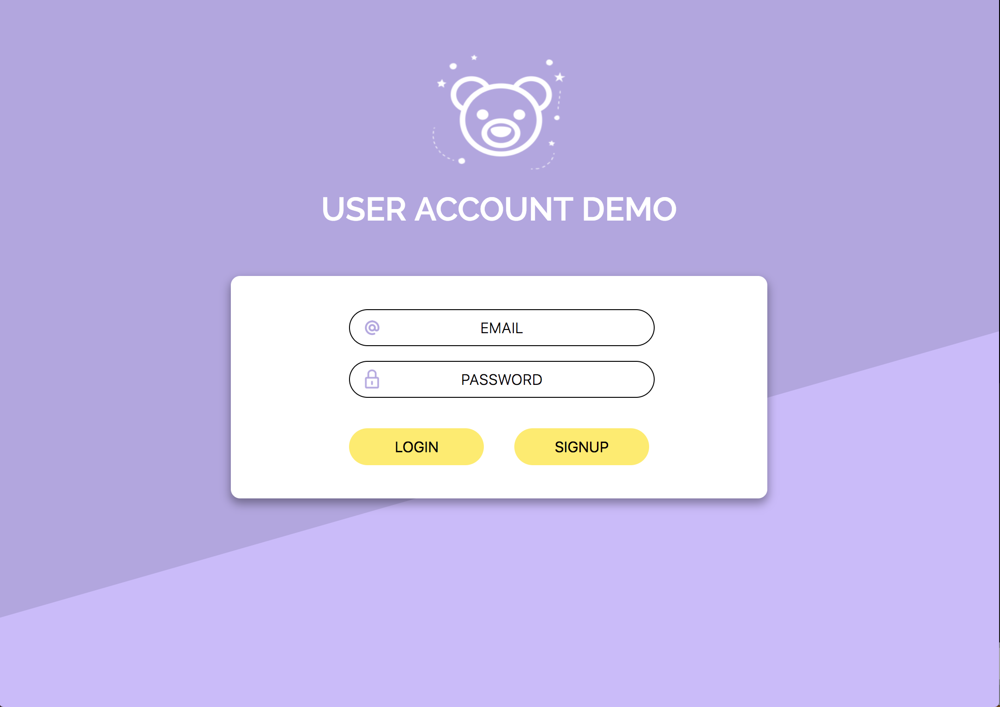

# Account creation with REACT & NODE 🐻
A simple user account creation boilerplate.



## Getting Started

These instructions will get you a copy of the project up and running on your local machine for development and testing purposes. See deployment for notes on how to deploy the project on a live system.

### Prerequisites

What things you need installed before running this application.

* [NODE](https://nodejs.org/en/download/)
* [NPM](https://docs.npmjs.com/cli/install)
* [YARN](https://yarnpkg.com/lang/en/docs/install)
* [MySQL](https://dev.mysql.com/downloads/windows/installer/8.0.html)

### Installing

A step by step series of examples that tell you how to get a development env running

1.)
```
Inside the server folder update the config.json file which is located in the config folder.

 "development": {
    "username": "root",
    "password": "password",
    "database": "account_demo",
    "host": "127.0.0.1",
    "dialect": "mysql"
  }

```
2.)
```
Open MySQL shell and run: CREATE DATABASE "database name here";
The database name should reflect what is in the config file.
no need to create any tables, this application use sequelize which will sync the models that are in the server directory

```
3.)
```
Open a new shell
cd into the server directory
run npm i (install)
this will install all dependaciesy for the node portion of this application
once the installs have completed
run node server.js
the Node application is set to run on PORT 8000 
* if you update the PORT make sure to update the proxy in the client package.json as well


```
4.)
```
Open a new shell 
cd into the client directory
run yarn install
this will install all dependaciesy for the react portion of this application
once the installs have completed
run yarn start 
the React application by default will run on PORT 3000

```

<!-- 
## Deployment
additional notes about how to deploy this on a live system
 -->
## Built With

* [express](http://expressjs.com/) - Node.js web application framework
* [passport](http://www.passportjs.org/) - authentication for Node.js
* [sequelize](http://docs.sequelizejs.com/) - promise-based ORM for Node.js


<!-- ## Versioning
 -->


<!-- ## License

This project is licensed under the MIT License - see the [LICENSE.md](LICENSE.md) file for details -->


